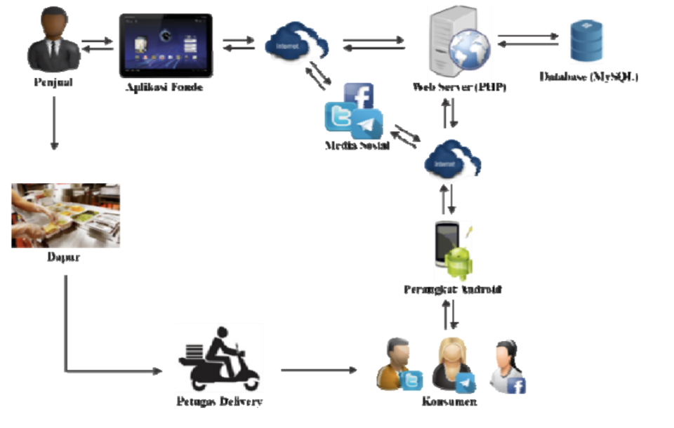
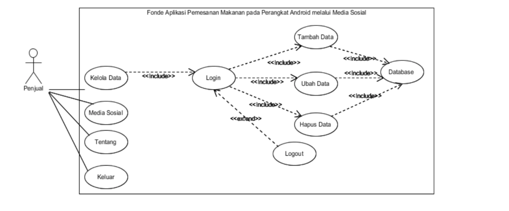
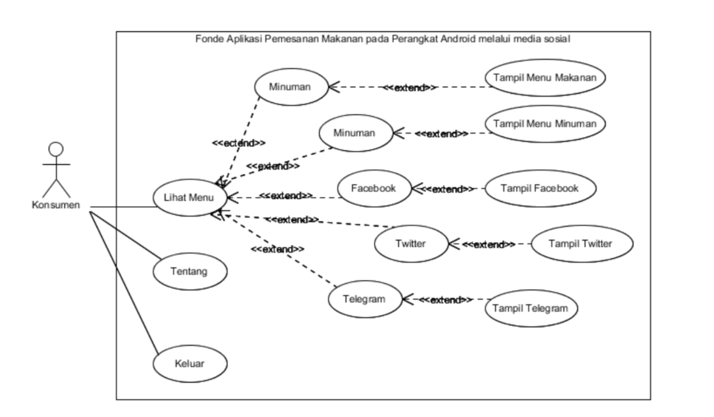

# Soal
1. Disebutkan seorang client membutuhkan layanan aplikasi antar makanan. Dan Anda
diminta untuk membuat desain sistem dengan kriteria pelanggan hanya dilayani dengan mobile apps.
    - Desainlah stack backend dan micro service layanan tersebut beserta tools dan alasan mengapa memilih design dan tools tersebut.
2. Bagaimana menangani keamanan dalam pengiriman data (backend dan mobile apps) pada sistem diatas.
    - Jelaskan solusi tersebut beserta alasannya.
3. Buatlah sebuah service RESTFul API berdasarkan dokumentasi apiary berikut. Soal nomor 3 tidak ada hubungannya dengan soal nomor 1. https://testbinar.docs.apiary.io/. Boleh menggunakan bahasa apapun.
    - Sertakan panduan cara instalasi tools, pengaturan database, penggunaan kode dan cara ujicoba kode dalam file Readme.md
    - Sertakan tangkapan layar proses ujicoba API menggunakan postman.
    - Kode yang baik adalah kode yang bisa dibaca dan dipakai oleh orang lain.
4. Dari dokumen https://testbinar.docs.apiary.io/, menurut anda, apakah ada desian API yang kurang maupun keliru? Jika ada, tuliskan kekurangan-kekurangan desain tersebut dan bagaimana seharusnya dokumentasi itu ditulis.

# Jawaban

## 1 Design {Aplikasi Antar Makanan}

### Gambaran Umum 
Aplikasi pemesanan makanan pada perangkat android melalui media sosial ditujukan untuk rumah makan yang menyediakan jasa pengantaran (delivery). Aplikasi ini dapat menampilkan integrasi beberapa media sosial seperti facebook, twitter, dan telegram yang digunakan untuk memantau dan menanggapi pesanan dari konsumen oleh pihak rumah makan penyedia jasa delivery.

### Pemodelan
Pemodelan UML yang digunakan meliputi Use Case dan Activity Diagram.
- Penjual dapat melakukan empat interaksi pada sistem aplikasi, yaitu kelola data, media sosial, tentang, dan keluar. Untuk kelola data penjual harus melakukan login terlebih dahulu. Setelah berhasil login maka penjual akan dapat melakukan manipulasi data menu makanan seperti tambah data, ubah data, dan hapus data. 
Pada media sosial, penjual dapat membuka beberapa media sosial secara bersamaan dalam satu layar pc android dengan syarat harus terkoneksi dengan jaringan internet. 
Untuk tentang, penjual akan ditampilkan informasi mengenai aplikasi dan pengembang aplikasi. 
Sedangkan keluar berfungsi untuk mempermudah penjual dalam keluar dari aplikasi.

- Pembeli dapat melakukan 3 interaksi di dalam sistem, yaitu lihat menu, tentang, dan keluar dari sistem. 
Untuk lihat menu konsumen dapat melihat menu makanan dan minuman yang ada pada rumah makan. 
Kemudian setelah mengetahui menu yang hendak dipesan, konsumen dapat melakukan pemesanan secara online melalui media sosial yang telah tersedia pada aplikasi yaitu facebook, twitter, dan telegram yang mana setiap media sosial telah terarahkan ke akun rumah makan penyedia jasa delivery.

## 2 Security
### HTTPS
Protokol transfer hiperteks adalah versi aman dari HTTP, protokol komunikasi dari World Wide Web. Ditemukan oleh Netscape Communications Corporation untuk menyediakan autentikasi dan komunikasi tersandi dan penggunaan dalam komersi elektris.
HTTPS menjamin tiga keamanan berikut:
- Autentikasi server memungkinkan peramban dan pengguna memiliki kepercayaan bahwa mereka sedang berbicara kepada server aplikasi sesungguhnya.
- Kerahasiaan data berarti eavesdropper tidak dapat mengerti komunikasi antara peramban pengguna dan server web, karena data tersandi.
- Integritas data berarti penyerang jaringan tidak dapat merusak atau mengubah isi komunikasi antara peramban pengguna dengan server web, karena divalidasi oleh message authentication code (MAC).
### Json Web Token (JWT)

Dimana JWT atau Token ini seperti password jadi ketika users berhasil melakukan Login maka server akan memberikan sebuah Token. Nanti Token tersebut akan disimpan oleh users pada Local Storage atau Cookies Browser dan bila users ingin mengakses halaman halaman tertentu maka harus menyertakan token tersebut.  
- Headernya sendiri hanya terdiri dari Algoritma HS256 yang kita gunakan dan Typenya jwt sebagai defaultnya.
- Payloadnya sebagai infomasi atau data yang ingin kita kirimkan untuk users misalnya _id usernya atau tanggal expirednya dan lain lain.
- Verify Signature adalah hasil dari Hash atau gabungan dari isi encode Header dan Payloadnya lalu ditambahkan kode secretnya.
  

## 3 Developing
https://github.com/Kneotrino/assesment

## 4 Code Review

- EndPoint
    - Pengunanan endpoint "V1" dan "V2" yang ambigu, solusinya adalah "V1" di ganti ke "API"   
- Pageable
    - Data dapat dengan mudah bertambah hingga ke jumlah yang sangat mengejutkan, dengan menerapkan konsep "Pageable" kita bisa menghemat pengunaan resource serta tidak akan terjadi Over-Reach dan secara tidak langsung performa database akan lebih baik karena hanya mengembalikan data yg dibutuhkan
- Test Skenario
    - Kekurangan saran test skenario yg di lakukan    